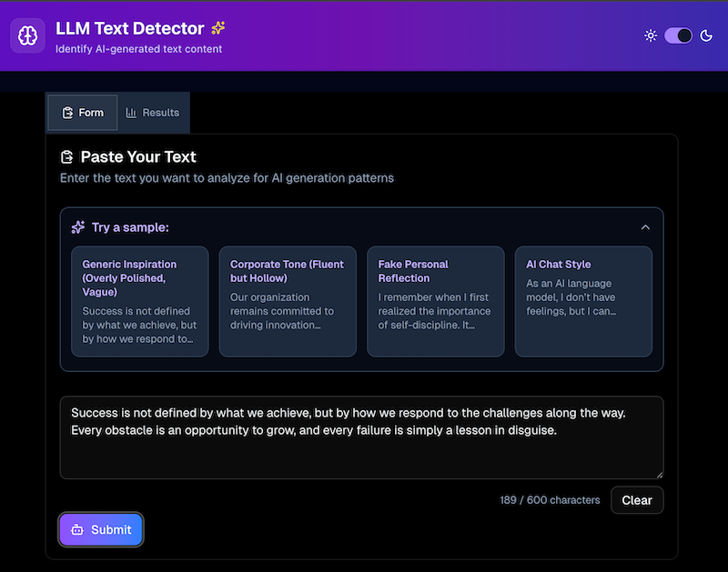
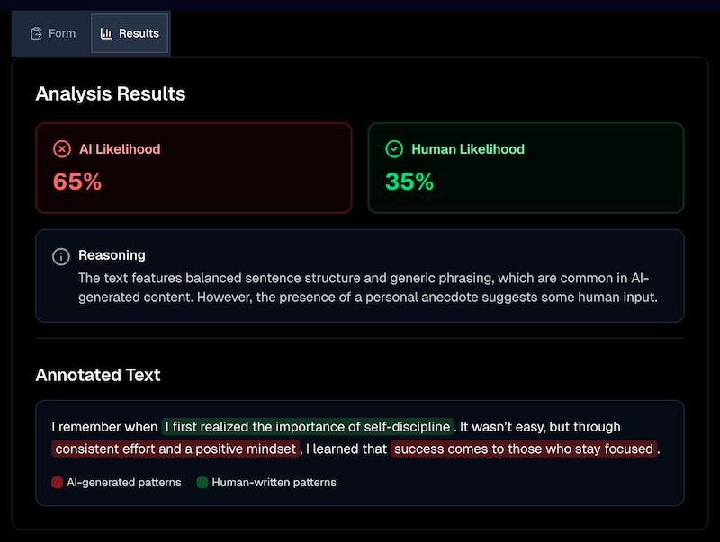

## LLM-generated text detector overview
This tool allows the user to paste in an extract of text, which will be analyzed to determine
the likelihood that it was generated by an LLM.

## Instructions to run locally
- `git clone` this repo
- `pnpm i` to install dependencies
- Copy `.env.example` to `.env.local` and populate your `OPENAI_API_KEY` variable.
- `pnpm dev` to start server, and then visit http://localhost:3000/

## Screenshots

## Frontend tools used
- Next.js
- Tailwind CSS
- Shadcn/ui for UI componentry
- lucide-react for icons